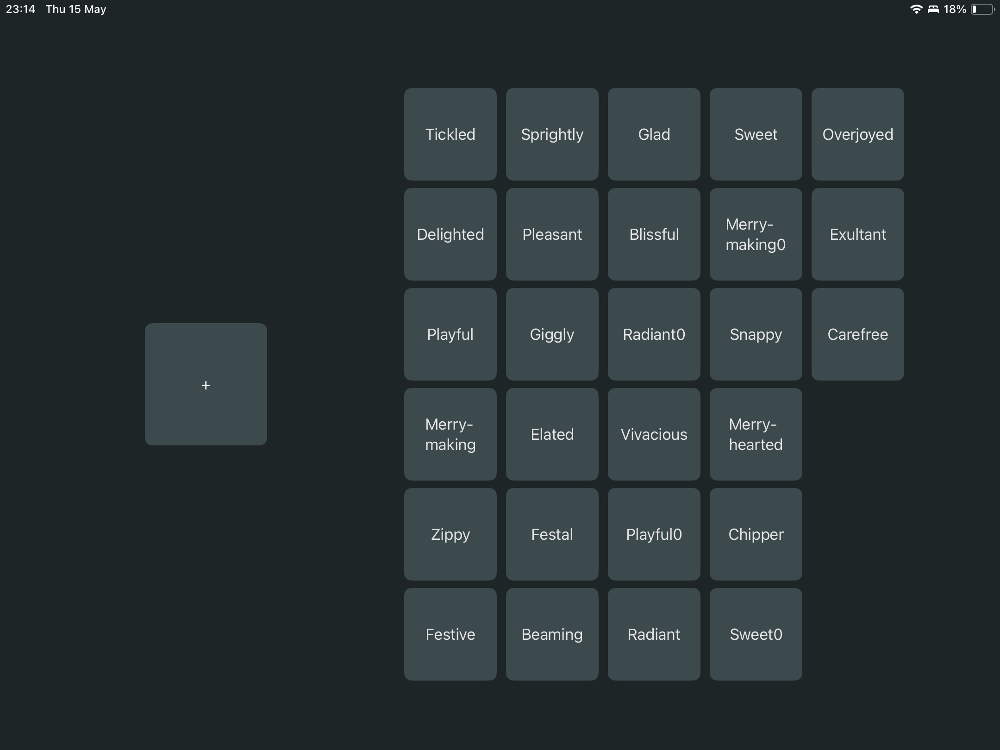

# Photobook cpp exercise

 This project should be able to generate a pdf photobook based on a folder structure filled with photos.




## Build and Run

### Windows
Install the required packages using vcpkg:
```install-prerequisites.bat```

Run ```build-pblib.bat```

Open the solution file from ```cpp-photobook\windows```


### macOS
Install the required packages using vcpkg:
```./install-prerequisites.sh```

Run ```build-pblib.sh```

## Tests

macOS: ```./pbtests``` on macOS.

Windows: Run the pbtests projects in the solution file.


## Static analysis
CMake with ```STATIC_CHECK=true```, it will use clang-tidy.


## Troubleshoot
The known to work vcpkg version: ```2024.11.16```
